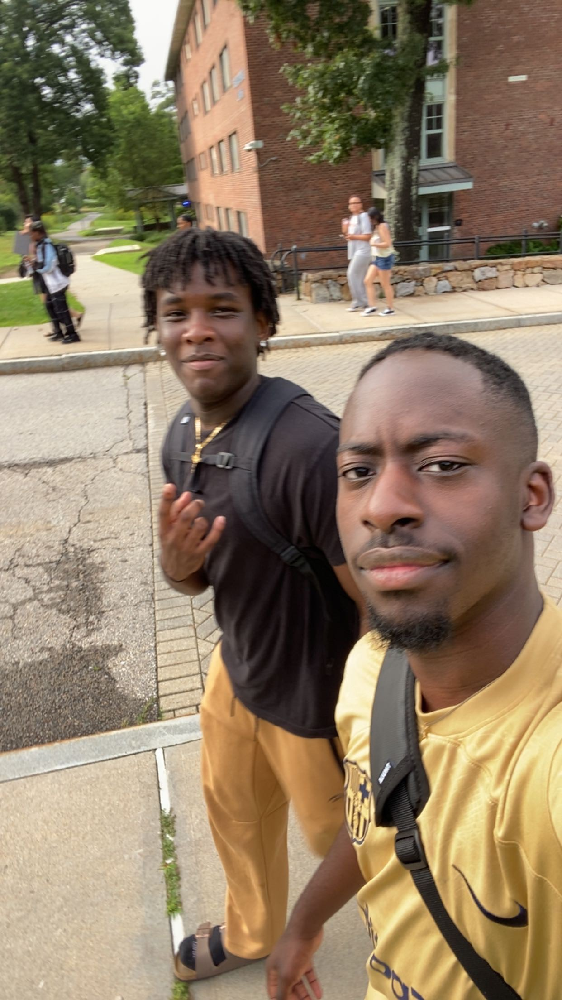

# Pictures
<div id="slideshow">

:::{include} _static/buttons.html
:::
<!--[Alt text](_static/img/IMG_3079.jpeg)
[Alt text](_static/img/IMG_3062.jpeg)-->
<style>
    body { background-color: lavender ;
     }
p {
  background-image: url("_static/img/cherry-blossom-sakura-tree-46b5m8kv0r60f4qs.gif");
}
p {color: black ;
}
h1 {
 color: grey
}
</style>

```{card}
:class-card: slide


+++
Me and O'ryan during TD
```
```{card}
:class-card: slide


+++
Me playing pokemon on a gameboy at my friends graduation party
```
</div>
